# Usando Nuclei para scan AWS

Olá! Eu sou o [Ben-Hur](https://www.linkedin.com/in/benhurott/) e este é um tutorial de como realizar um scan por misconfig na aws usando os templates do nuclei para AWS.


## Explicação detalhada

LINK_DO_VIDEO


## Links Gerais

- [AWS CLI](https://docs.aws.amazon.com/cli/latest/userguide/getting-started-install.html)
- [tfenv](https://github.com/tfutils/tfenv?tab=readme-ov-file#installation)
- [Terraform AWS](https://registry.terraform.io/providers/hashicorp/aws/latest/docs)
- [Go](https://go.dev/doc/install)
- [Nuclei](https://github.com/projectdiscovery/nuclei?tab=readme-ov-file#install-nuclei)


## Passos resumidos

### Criar conta aws

https://us-east-1.console.aws.amazon.com/iam/home?region=us-east-2#/users

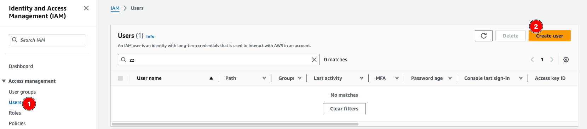

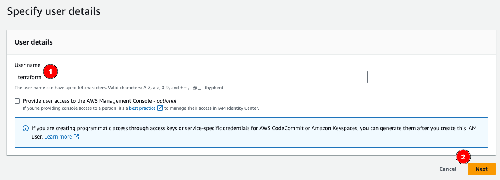

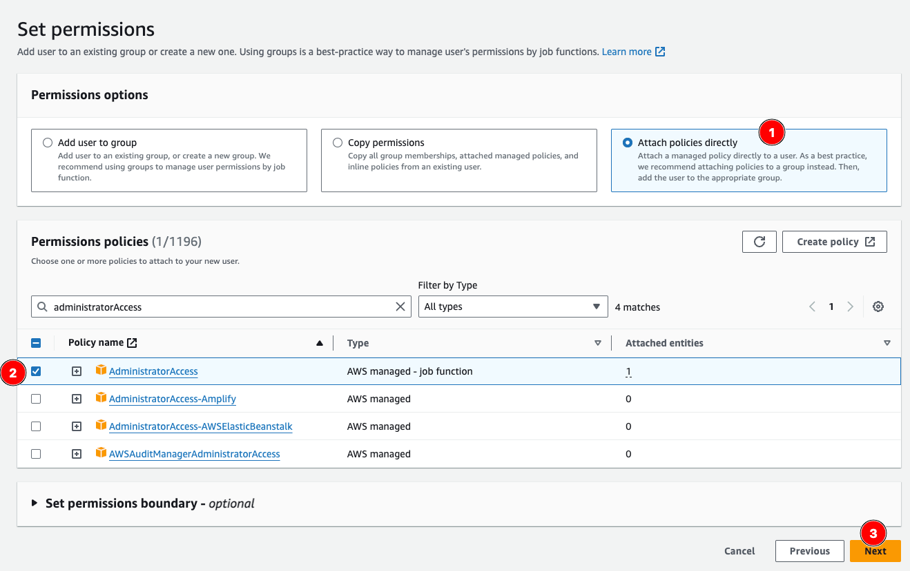

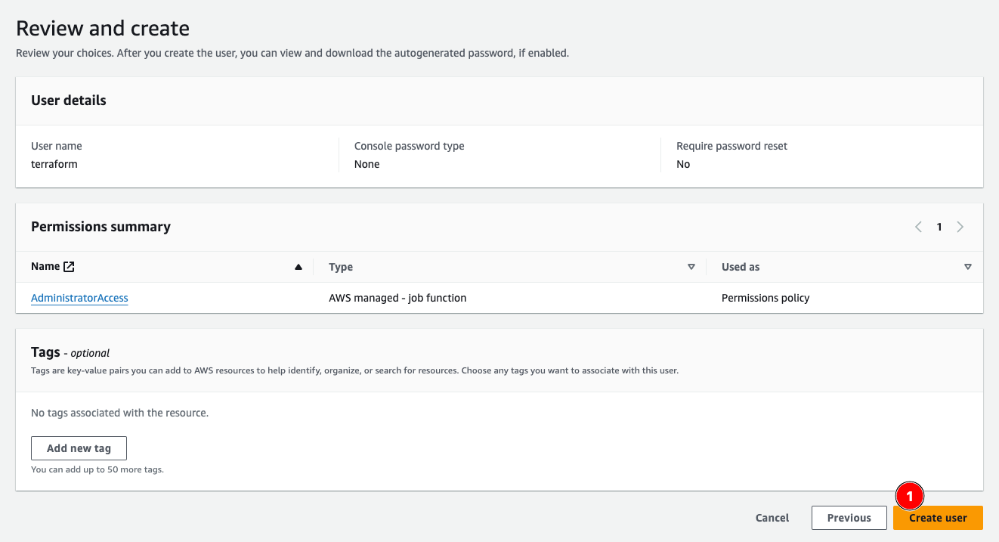

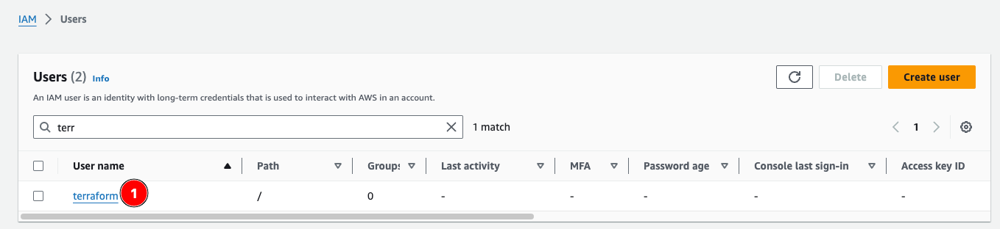

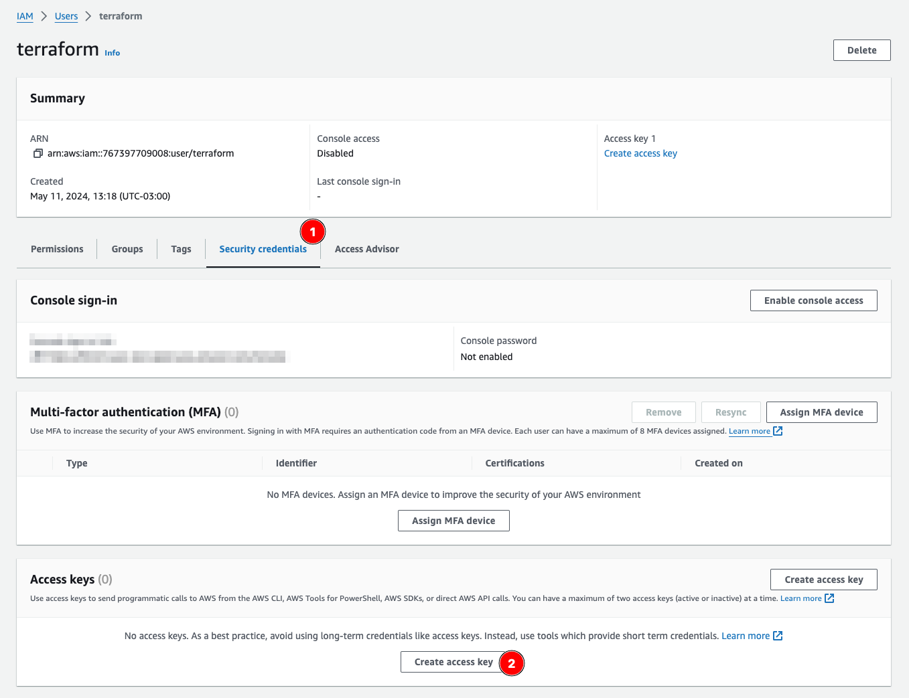

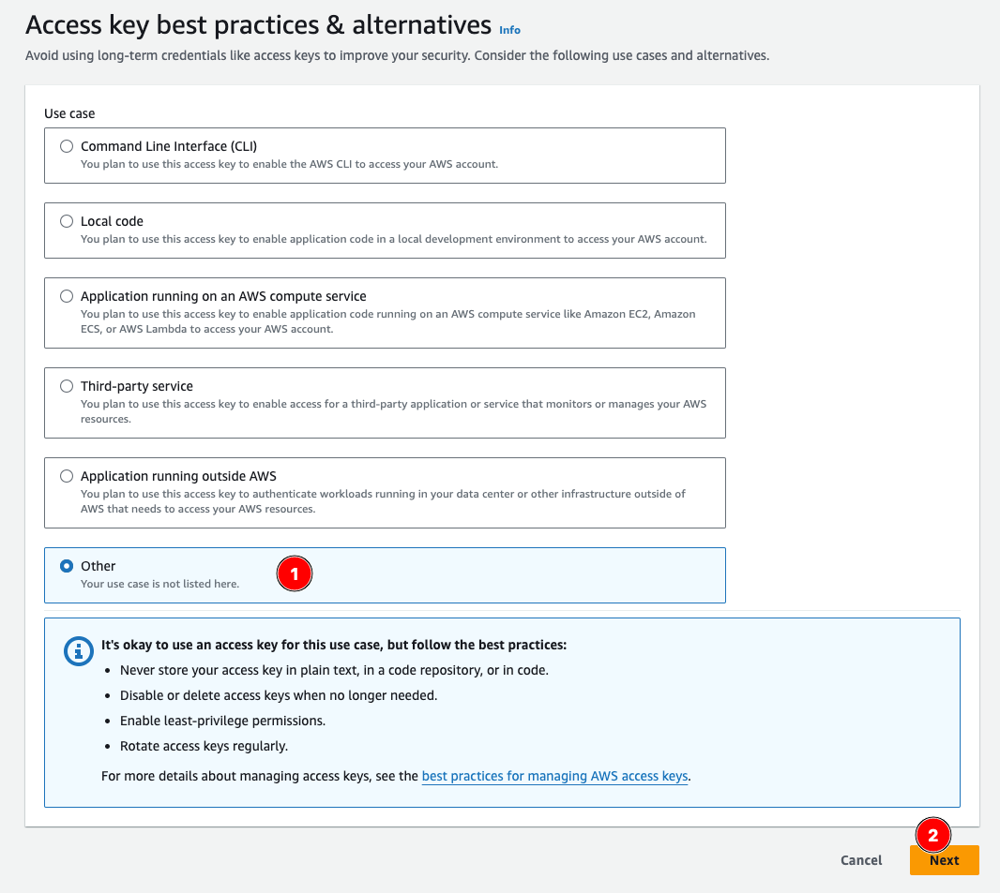

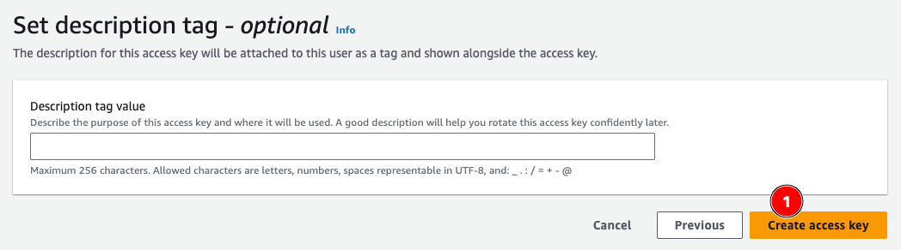

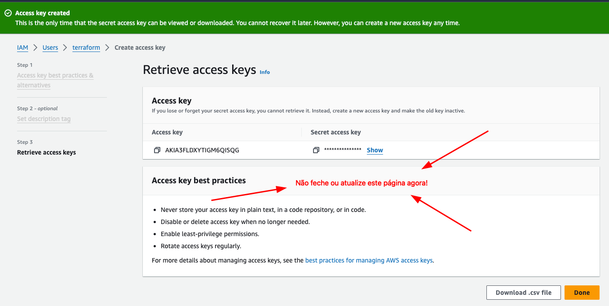

### Configurar AWS CLI

Instale o [AWS CLI](https://docs.aws.amazon.com/cli/latest/userguide/getting-started-install.html)


Configure o Perfil:

```sh
aws configure --profile "gdas-tf" # pode ser qualquer nome que você quiser.
```

Aqui ele vai te pedir:

```
AWS Access Key ID: ******** # a access key do console da aws.
AWS Secret Access Key: ******* # a private key do console da aws
Default region name: us-east-1 # pro Brasil é melhor essa.
Default output format: json # para o resultado do CLI ser em json
```

Agora vamos definir no nosso terminal que qualquer comando AWS executado aqui vai usar o perfil:

```sh
export AWS_DEFAULT_PROFILE=gdas-tf
```

Liste os buckets para ver se tudo funciona corretamente:

```sh
aws s3api list-buckets
```

```json
{
    "Buckets": [],
    "Owner": {
        "DisplayName": "****",
        "ID": "c526507a816********6d765cc934a2"
    }
}
```

### Instalando o Terraform

Instale o [tfenv](https://github.com/tfutils/tfenv?tab=readme-ov-file#installation)


Instale o terraform usando o tfenv:

```sh
tfenv install #instala a ultima versão
tfenv use #usa a ultima versao

# Switching default version to v1.8.3
# Default version (when not overridden by .terraform-version or TFENV_TERRAFORM_VERSION) is now: 1.8.3
```

Verifique que esta tudo funcionando:

```sh
terraform -v

# Terraform v1.8.3
# on darwin_arm64
```

### Iniciando o projeto Terraform

Escolha uma pasta para iniciar o projeto e execute:

```sh
tfenv pin # fixa a versão do tf para esta pasta com o arquivo .terraform-version
terraform init # cria os arquivos do tf
```


### Criando o arquivo terraform

Crie um arquivo `main.tf` com:

```tf
# aqui vamos definir as versões utilizadas no nosso terraform.
# este passo é importante para evitar incompatibilidades com versões futuras.
terraform {

    # vamos definir para que providers queremos criar
    # e quais "engines" vamos usar.
    # você pode ver o provider da AWS na documentação oficial aqui:
    # https://registry.terraform.io/providers/hashicorp/aws/latest/docs
    required_providers {
        aws = {
        source  = "hashicorp/aws"
        version = "~> 5.49"
        }
    }
    
    # aqui está a versão do terraform que estamos usando
    required_version = ">= 1.8.3"
}

# vamos definir as infos para nosso provider
provider "aws" {
    # qual profile vamos usar
    profile = "gdas-tf"

    # qual região vamos usar
    region  = "us-east-1"
}

# aqui vamos criar um bucket público
# aws_s3_bucket: tipo de recurso a ser criado
# public_bucket: nome do recurso
resource "aws_s3_bucket" "public_bucket" {
  # id unico do bucket
  bucket = "gdas-my-public-bucket-822412123123"

  # tags para identificar o bucket
  tags = {
    Name        = "Public S3 Bucket"
    Environment = "dev"
  }
}

# aqui vamos definir as regras de acesso ao bucket
# aws_s3_bucket_public_access_block: tipo de recurso a ser criado
# public_bucket: nome do recurso
resource "aws_s3_bucket_public_access_block" "public_bucket" {
  bucket = aws_s3_bucket.public_bucket.id

  block_public_acls       = false
  block_public_policy     = false
  ignore_public_acls      = false
  restrict_public_buckets = false
}

# aqui vamos definir a política de acesso ao bucket
# aws_s3_bucket_policy: tipo de recurso a ser criado
# public_bucket_policy: nome do recurso
resource "aws_s3_bucket_policy" "public_bucket_policy" {
  bucket = aws_s3_bucket.public_bucket.id
  policy = jsonencode({
    Version = "2012-10-17"
    Statement = [
      {
        Sid = "PublicListGet"
        Effect = "Allow"
        Principal = "*" # permite acesso de qualquer origem
        Action = [
          "s3:ListBucket", # permite listar os objetos do bucket
          "s3:GetObject" # permite pegar os objetos do bucket
        ]
        Resource = [
          aws_s3_bucket.public_bucket.arn, # permite acesso ao bucket
          "${aws_s3_bucket.public_bucket.arn}/*" # permite acesso aos objetos do bucket   
        ]
      }
    ]
  })
}
```

### Crie a infra na AWS

Execute o comando:

```sh
terraform apply

# ...
# Plan: 3 to add, 0 to change, 0 to destroy.
# ...
# Apply complete! Resources: 3 added, 0 changed, 0 destroyed.
```

Você deverá ver na sua conta da AWS o bucket criado:

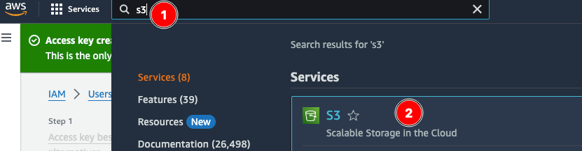

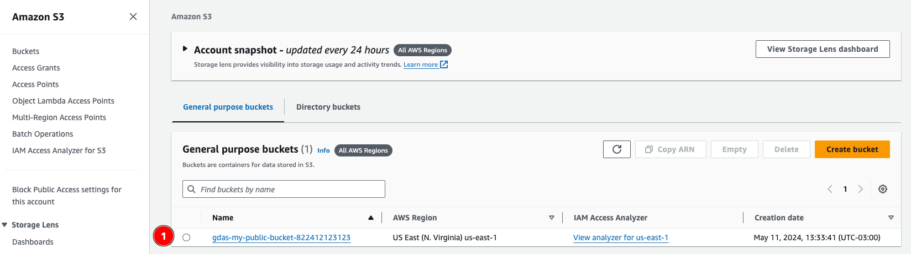


### Upload de arquivo

Vamos fazer um upload de arquivo no nosso bucket.

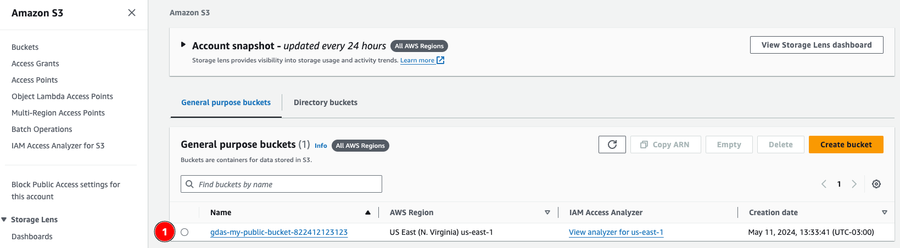

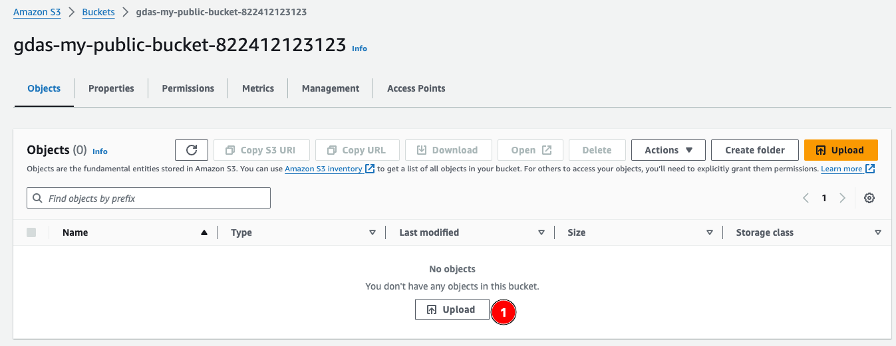

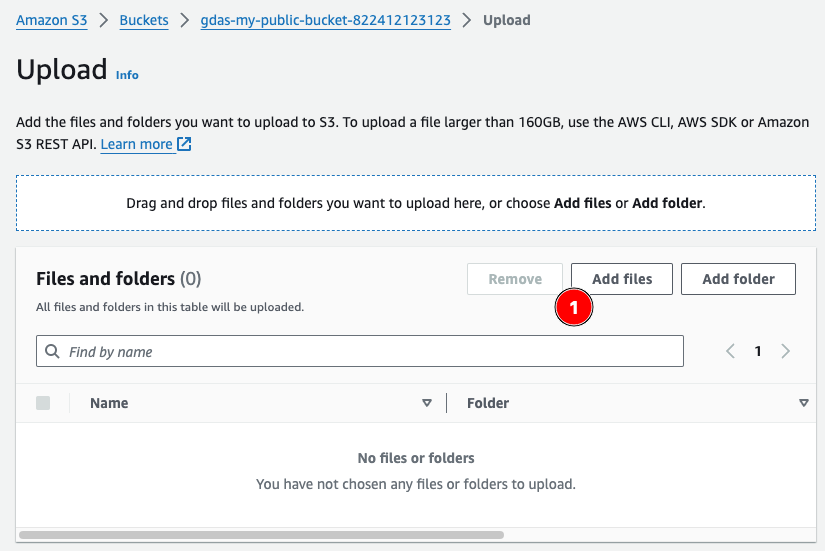

Selecione um arquivo qualquer em seu computador.

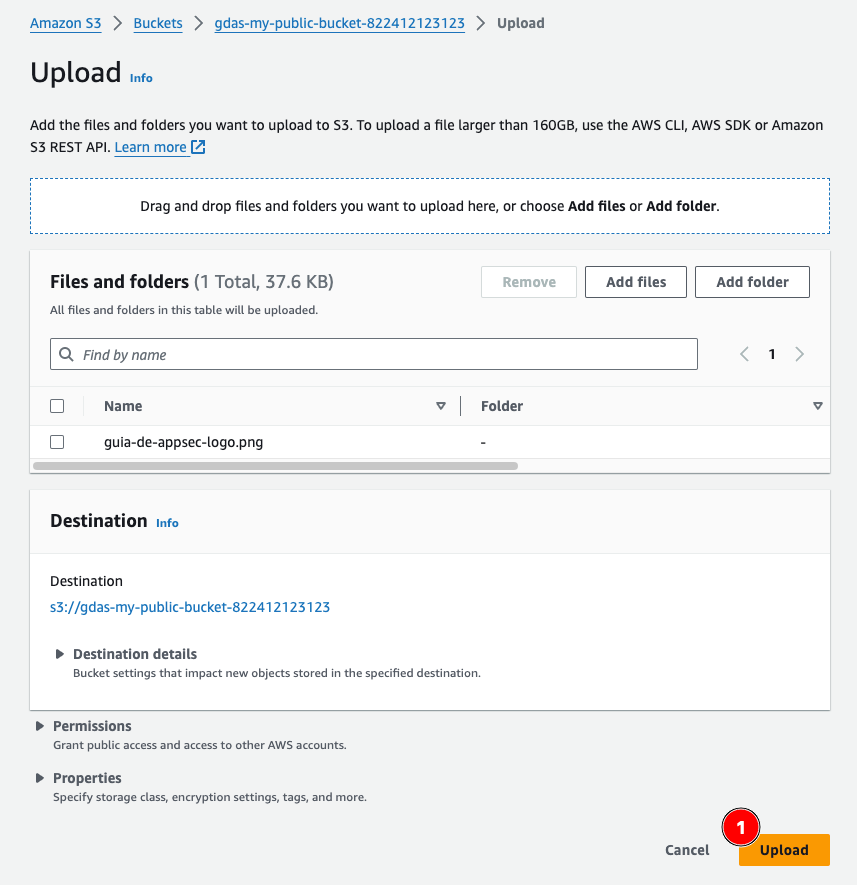

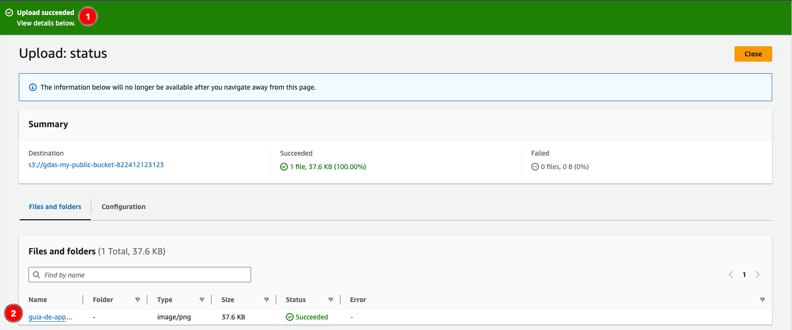


Vamos abrir o arquivo para vermos se temos acesso a imagem e ao bucket.

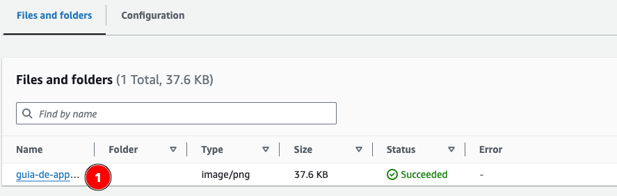

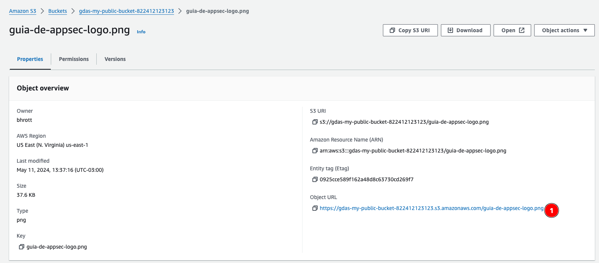

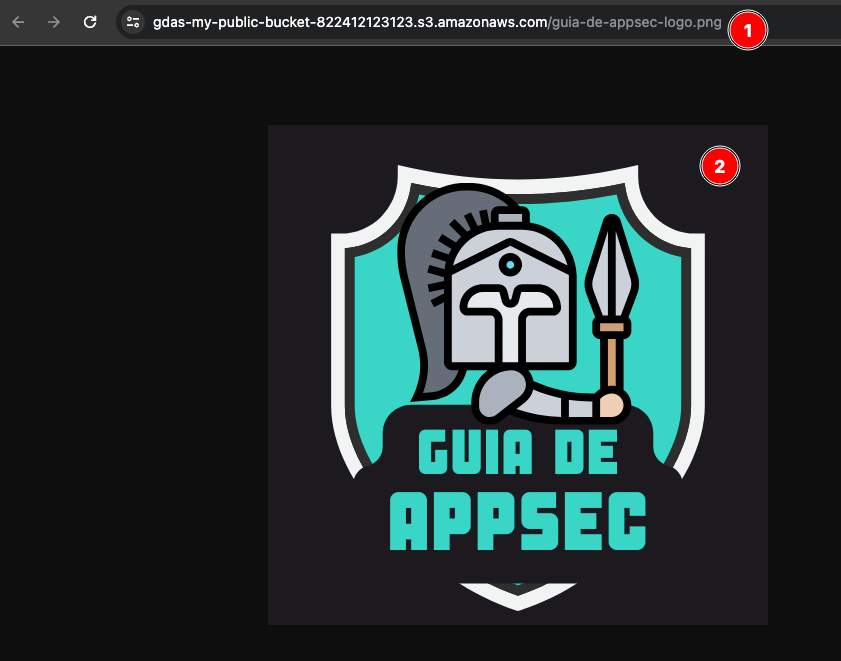

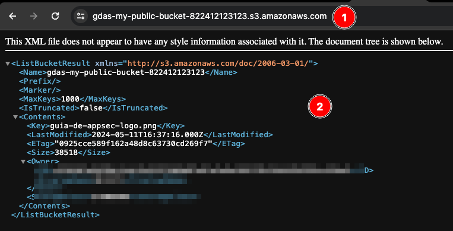


### Instalando o Nuclei

Você vai precisar ter o [Go](https://go.dev/doc/install) instalado.

Instale o [Nuclei](https://github.com/projectdiscovery/nuclei?tab=readme-ov-file#install-nuclei)


Execute os comandos para atualizar o nuclei:

```sh
nuclei -up # atualizar o nuclei
nuclei -ut # atualizar os templates
```

### Scan dos buckets com os templates

```sh
nuclei -t cloud/aws/s3/ -code
```

```

                     __     _
   ____  __  _______/ /__  (_)
  / __ \/ / / / ___/ / _ \/ /
 / / / / /_/ / /__/ /  __/ /
/_/ /_/\__,_/\___/_/\___/_/   v3.2.7

		projectdiscovery.io

[WRN] Found 1 template[s] loaded with deprecated paths, update before v3 for continued support.
[INF] Current nuclei version: v3.2.7 (latest)
[INF] Current nuclei-templates version: v9.8.6 (latest)
[WRN] Scan results upload to cloud is disabled.
[INF] New templates added in latest release: 65
[INF] Templates loaded for current scan: 11
[INF] Executing 11 signed templates from projectdiscovery/nuclei-templates
[s3-versioning] [code] [low]  ["Versioning is not enabled for S3 Bucket gdas-my-public-bucket-822412123123"]
[s3-bucket-policy-public-access] [code] [critical]  ["The S3 bucket gdas-my-public-bucket-822412123123 is publicly accessible via Policy"]
[s3-access-logging] [code] [medium]  ["The S3 bucket gdas-my-public-bucket-822412123123 does not have access logging enabled."]
[s3-mfa-delete-check] [code] [low]  ["The S3 bucket gdas-my-public-bucket-822412123123 is not configured to use MFA Delete feature"]
```

### Clean Up

Não esqueça de limpar sua conta da AWS para não ser cobrado.

```sh
# excluindo os arquivos do bucket
aws s3 rm s3://gdas-my-public-bucket-822412123123 --recursive

# excluir a infra criada
terraform destroy
```